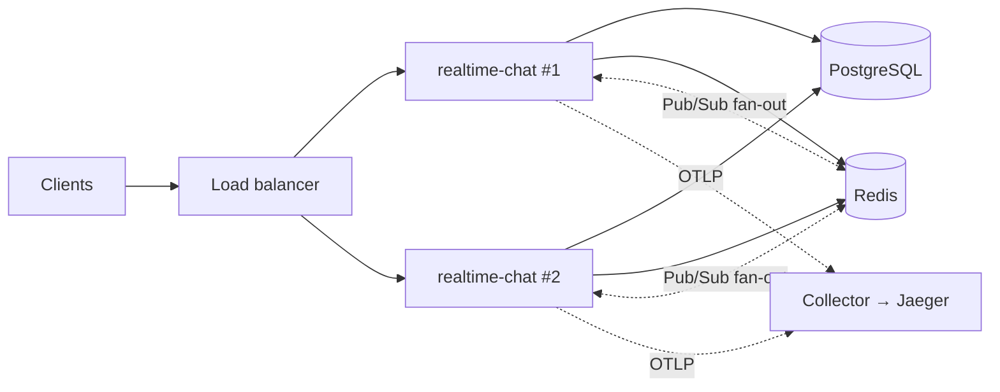

<div align="center">

# realtime-chat

**A distributed real-time messaging platform written in Modern C++20.**

Direct and group chat over REST and WebSockets, with the operational machinery
a real deployment needs: role-based access control, an audit trail, full-text
search, horizontal scaling, and distributed tracing.

[](https://github.com/devtejasx/realtime-chat/actions/workflows/ci.yml)
[](https://github.com/devtejasx/realtime-chat/actions/workflows/lint.yml)
[](https://github.com/devtejasx/realtime-chat/actions/workflows/codeql.yml)
[](https://github.com/devtejasx/realtime-chat/actions/workflows/security.yml)
[](https://github.com/devtejasx/realtime-chat/actions/workflows/docker.yml)


[Quick start](#quick-start) · [Features](#features) · [Architecture](#architecture) ·
[API](#api) · [Deployment](#deployment) · [Documentation](#documentation)

</div>

---

## What this is

A chat backend built the way a service that has to stay up gets built. Every
external dependency sits behind an interface with a working default, so the whole
system **builds and runs with no external services** beyond PostgreSQL — then
scales out by swapping implementations, with no change to business logic.

The design decisions that are easy to get wrong are documented *where they are
made*, in the code, with the reasoning: why roles are resolved from the database
rather than the JWT, why liveness probes must not touch dependencies, why the
WebSocket protocol is negotiated instead of unioned.

## Quick start

Everything, including the database:

```bash
docker compose up --build
```

Check it is alive, then open the interactive API reference at
<http://localhost:8080/docs>:

```bash
curl http://localhost:8080/health
```

Register a user and send a message:

```bash
curl -sX POST localhost:8080/api/v1/auth/register -H 'Content-Type: application/json' -d '{"username":"ada","email":"ada@example.com","password":"correct-horse-battery"}'
```

## Features

### Messaging

| | |
| --- | --- |
| **Conversations** | One-to-one (deduplicated) and group chats with ownership, membership, rename, add/remove/leave |
| **Messages** | Send, edit, soft-delete, keyset pagination, per-conversation history |
| **Real time** | Messages, typing indicators, presence, read receipts — over WebSockets |
| **Reactions** | Emoji reactions with live fan-out |
| **Attachments** | Multipart upload with magic-byte content-type verification, thumbnails, pluggable storage (local default; S3/Azure/GCS seam) |
| **Notifications** | In-app feed plus a pluggable push provider (FCM/APNs/email/SMS seam) |
| **Search** | PostgreSQL full-text with `ts_rank_cd` ranking, `ts_headline` highlighting, and a trigram fuzzy fallback for typos |

### Security

| | |
| --- | --- |
| **Authentication** | bcrypt password hashing (CSPRNG salts) and JWT access/refresh tokens |
| **Sessions** | Distributed, with refresh-token rotation for replay protection and multi-device logout |
| **RBAC** | `user` / `moderator` / `admin` / `super_admin` over a `constexpr` permission table |
| **Revocation** | Authorization is database-authoritative behind a short-TTL cache, so a ban or demotion takes effect on the caller's **next request** — not at token expiry |
| **Audit log** | Append-only and idempotent, correlated with the request and trace that caused it, searchable through the admin API |
| **Hardening** | Security headers, CORS policy, rate limiting, MIME allow-list, upload and body-size limits |

### Scale and operations

| | |
| --- | --- |
| **Horizontal scaling** | Redis Pub/Sub fans WebSocket broadcasts across every replica, with origin-node loop suppression |
| **API versioning** | Routes authored once, served at `/api/v1/...` **and** the legacy `/api/...`; an unknown version returns a machine-readable 404 |
| **OpenAPI 3.1** | The spec is compiled into the binary and served at `/openapi.json`, with Swagger UI at `/docs`. A test asserts every registered route is documented |
| **Event bus** | Typed domain events dispatched on a worker pool with per-subscriber error isolation, so a slow subscriber never touches request latency |
| **Tracing** | W3C trace context propagation and OTLP/Zipkin export to Jaeger, Zipkin, Tempo or an OpenTelemetry Collector |
| **Metrics** | Prometheus exposition at `/metrics` |
| **Health probes** | `/health/live`, `/health/ready`, `/health/startup` — three probes answering three genuinely different questions |
| **Feature flags** | Eight runtime-togglable capabilities, seeded from the environment, switchable live by a super admin |
| **Admin module** | Users, groups, sessions, connected sockets, cache, jobs, system metrics, audit search, feature toggles |

### Engineering

| | |
| --- | --- |
| **Architecture** | Clean architecture — controllers → services → repositories, with DTOs, models, middlewares and a single composition root |
| **Testing** | GoogleTest across config, validation, security, every service, realtime managers, and the API, plus opt-in database integration tests. HTTP-level suites drive the real Crow router — one in-process (`ctest -L unit`) and one against a live socket (`ctest -L live`) — asserting prefix parity and that the OpenAPI document matches the DTOs it describes |
| **Benchmarks** | Google Benchmark for JWT, cache, protocol encoding, event bus, authorization and PostgreSQL |
| **Load testing** | k6 scenarios for authentication, messaging, WebSocket concurrency and upload/search |
| **CI/CD** | GitHub Actions — build, test, coverage, clang-format/clang-tidy, CodeQL, secret scanning, GHCR image push, tagged releases |
| **Infrastructure** | Docker and Compose, Nginx with TLS, systemd unit, Kubernetes manifests, Terraform for AWS |

## Architecture



Dependencies point inward: the domain layer knows nothing about PostgreSQL, Crow
or Redis. Services depend on interfaces the domain owns, and infrastructure
implements them — which is why the test suite exercises real service code with no
database at all.

The dotted Pub/Sub edges are load-bearing. A WebSocket connection is pinned to
whichever replica accepted it, so without that hop a message persisted by replica
1 never reaches a recipient connected to replica 2. On a single replica the
problem is invisible; it appears the moment you scale.

Ten diagrams — system, layering, ERD, request lifecycle, authentication, RBAC,
WebSocket, event flow, cache, deployment — are in
[docs/Diagrams.md](docs/Diagrams.md).

## API

The live reference is **Swagger UI at `/docs`**, backed by the OpenAPI 3.1
document at `/openapi.json`.

Every endpoint below is reachable at both `/api/v1/...` (canonical, and what the
OpenAPI document publishes) and the unversioned `/api/...` (a permanently
supported alias for the default version). Both are real registered routes
bound to the same handler, so they are identical in behaviour — not a redirect
and not a rewrite. Nothing is deprecated and there is no migration deadline;
adopting the versioned prefix means adding `/v1` to the base URL and changing
nothing else. Responses carry `X-API-Version`, and an unsupported version
returns a machine-readable `unsupported_api_version` error naming the versions
this build serves. See [docs/API.md](docs/API.md#versioning) for the details.

| Area | Endpoints |
| --- | --- |
| Authentication | `POST /auth/register`, `/auth/login`, `/auth/refresh`, `/auth/logout`, `/auth/logout-all` · `GET /auth/me` |
| Users | `GET`/`PUT /users/me` · `GET /users/{id}` |
| Conversations | `POST`/`GET /conversations` · `GET`/`DELETE /conversations/{id}` · `PATCH /conversations/{id}/name` · `POST`/`DELETE /conversations/{id}/members…` · `POST /conversations/{id}/leave` |
| Messages | `POST`/`GET /messages` · `PATCH`/`DELETE /messages/{id}` |
| Reactions | `POST`/`GET`/`DELETE /messages/{id}/reactions` |
| Attachments | `POST /attachments` · `GET`/`DELETE /attachments/{id}` · `GET /attachments/{id}/thumbnail` |
| Notifications | `GET /notifications` · `POST /notifications/{id}/read` · `POST /notifications/read-all` · `DELETE /notifications/{id}` |
| Sessions | `GET /sessions` · `DELETE /sessions/{id}` |
| Search | `GET /search/messages?q=…` |
| Admin | `/admin/users…`, `/admin/conversations/{id}`, `/admin/websockets`, `/admin/cache`, `/admin/jobs`, `/admin/system`, `/admin/audit-logs`, `/admin/features` |
| WebSocket | `GET /ws?token=…&protocol=2` |
| Operations | `GET /health`, `/health/live`, `/health/ready`, `/health/startup`, `/metrics`, `/docs`, `/openapi.json` |

Failures share one envelope, with a stable machine-readable `code`:

```json
{ "error": { "code": "validation_error", "message": "Username is required", "details": "field=username" } }
```

Full details: [docs/API.md](docs/API.md) ·
[docs/WebSocketProtocol.md](docs/WebSocketProtocol.md) ·
[docs/Authorization.md](docs/Authorization.md)

## Build from source

**Prerequisites:** a C++20 compiler, CMake ≥ 3.24, Ninja (optional), and the
PostgreSQL and OpenSSL development headers. Everything else (Crow, libpqxx,
spdlog, jwt-cpp, bcrypt, GoogleTest) is fetched by CMake at configure time, so the
first configure needs network access.

```bash
sudo apt-get install -y build-essential cmake ninja-build git libssl-dev libpq-dev
```

```bash
./scripts/build.sh
```

```bash
./scripts/test.sh
```

Run the server — it needs a reachable PostgreSQL, which `docker-compose.yml`
provides:

```bash
cp .env.example .env && ./scripts/run.sh
```

### Build options

| Option | Default | Purpose |
| --- | --- | --- |
| `RTC_BUILD_TESTS` | `ON` | GoogleTest suite |
| `RTC_BUILD_BENCHMARKS` | `OFF` | Google Benchmark suite (fetches an extra dependency) |
| `RTC_WITH_REDIS` | `OFF` | Redis cache and cluster bus — **required for more than one replica** |
| `RTC_ENABLE_COVERAGE` | `OFF` | gcov/lcov instrumentation (use with `Debug`) |
| `RTC_WARNINGS_AS_ERRORS` | `OFF` | Promote warnings to errors |

### Benchmarks, coverage and load tests

```bash
cmake -S . -B build -DCMAKE_BUILD_TYPE=Release -DRTC_BUILD_BENCHMARKS=ON && cmake --build build && ./build/bin/rtc_benchmarks
```

```bash
./scripts/coverage.sh --open
```

```bash
k6 run --env BASE_URL=http://localhost:8080 loadtest/messaging.js
```

## Configuration

Every setting comes from an environment variable and has a development default;
[`.env.example`](.env.example) documents the full list. Invalid configuration
fails at startup rather than at first use — for instance the server refuses to
boot in production with a weak `JWT_SECRET`, or with `CLUSTER_ENABLED` set but no
Redis.

The settings most worth knowing:

| Variable | Default | Notes |
| --- | --- | --- |
| `JWT_SECRET` | dev placeholder | Must be ≥ 32 bytes in production; startup fails otherwise |
| `REDIS_ENABLED` | `false` | Enables the shared cache; needs a `-DRTC_WITH_REDIS=ON` build |
| `CLUSTER_ENABLED` | follows `REDIS_ENABLED` | **Required with more than one replica** — see the architecture note above |
| `AUTHZ_CACHE_TTL_SECONDS` | `30` | Worst-case delay before a ban or demotion takes effect |
| `TRACING_ENABLED` | `false` | With `TRACING_EXPORTER` = `logging` / `otlp` / `zipkin` |
| `ENABLE_*` | `true` | Eight feature flags, also togglable at runtime by a super admin |

## Deployment

The full production stack — PostgreSQL, Redis, the app and Nginx with TLS — is one
command:

```bash
export JWT_SECRET="$(openssl rand -hex 32)" DB_PASSWORD="$(openssl rand -hex 16)" && docker compose -f docker-compose.prod.yml up -d --build
```

Certificates come from `DOMAIN=… EMAIL=… ./scripts/ssl/init-letsencrypt.sh`.

| Target | Where |
| --- | --- |
| Docker / Compose | [docs/Docker.md](docs/Docker.md) |
| Kubernetes | [deploy/k8s/](deploy/k8s/README.md) — Deployment, Service, Ingress, ConfigMap, Secret, HPA, PDB, NetworkPolicy |
| AWS (Terraform) | [deploy/terraform/](deploy/terraform/README.md) — VPC, EC2, RDS, ElastiCache, IAM, security groups, ALB |
| AWS (scripts) | [docs/AWS.md](docs/AWS.md) |
| systemd | [deploy/systemd/](deploy/systemd/) |

Operational guidance, the readiness checklist and the runbook are in
[docs/Deployment.md](docs/Deployment.md).

## Repository layout

```
.
├── include/rtc/            # public headers, by layer
├── src/                    # implementation (mirrors include/)
├── tests/                  # GoogleTest suite + fakes
├── benchmarks/             # Google Benchmark microbenchmarks (opt-in)
├── loadtest/               # k6 load-test scenarios
├── migrations/             # SQL schema migrations
├── cmake/                  # dependency resolution
├── docker/                 # Dockerfile + production image
├── nginx/                  # reverse-proxy configuration
├── deploy/
│   ├── aws/                # EC2 deploy / rollback scripts
│   ├── k8s/                # Kubernetes manifests
│   ├── systemd/            # hardened service unit
│   └── terraform/          # AWS infrastructure as code
├── scripts/                # build / test / run / format / coverage helpers
└── docs/                   # architecture, diagrams, API, operations
```

## Documentation

**Design**
[Architecture](docs/Architecture.md) ·
[Diagrams](docs/Diagrams.md) ·
[Database](docs/Database.md)

**Interfaces**
[API](docs/API.md) ·
[WebSocket protocol](docs/WebSocketProtocol.md) ·
[Authorization & audit](docs/Authorization.md)

**Operations**
[Deployment](docs/Deployment.md) ·
[Docker](docs/Docker.md) ·
[AWS](docs/AWS.md) ·
[Kubernetes](deploy/k8s/README.md) ·
[Terraform](deploy/terraform/README.md) ·
[Monitoring](docs/Monitoring.md) ·
[Performance](docs/Performance.md) ·
[Load testing](loadtest/README.md) ·
[Troubleshooting](docs/Troubleshooting.md)

**Project**
[Security posture](docs/Security.md) ·
[Contributing](docs/Contributing.md) ·
[Release process](docs/Release.md)

## Tech stack

| Concern | Choice |
| --- | --- |
| Language | C++20 |
| HTTP / WebSocket | [Crow](https://github.com/CrowCpp/Crow) |
| Database | PostgreSQL + [libpqxx](https://github.com/jtv/libpqxx) |
| Cache / Pub/Sub | Redis (optional) via [redis-plus-plus](https://github.com/sewenew/redis-plus-plus) |
| Auth | bcrypt + JWT ([jwt-cpp](https://github.com/Thalhammer/jwt-cpp)) |
| Logging | [spdlog](https://github.com/gabime/spdlog) |
| JSON | [nlohmann/json](https://github.com/nlohmann/json) |
| Tracing | OpenTelemetry-compatible (OTLP/HTTP, Zipkin v2) |
| Build | CMake ≥ 3.24 (Ninja recommended) |
| Testing | GoogleTest · Google Benchmark · k6 |
| Container | Docker + Docker Compose |
| Orchestration | Kubernetes · Terraform |

<details>
<summary><strong>Project history</strong> — how it got here, phase by phase</summary>

<br>

**Phase 1 — Foundation & authentication.** Clean architecture, configuration,
structured logging, error handling, PostgreSQL with a connection pool and
migration runner, bcrypt + JWT auth, an authentication guard, a health endpoint,
tests, Docker.

**Phase 2 — Core real-time messaging.** User profiles, one-to-one and group
conversations, messages with edit and soft-delete, read receipts, pagination and
keyword search — over both REST and WebSockets. Session, connection and room
managers, an event dispatcher, presence, typing indicators, heartbeat and
disconnect cleanup. REST controllers and WebSocket handlers call the *same*
service classes, so business logic is never duplicated.

**Phase 3 — Scalability & production readiness.** A pluggable cache
(`ICacheStore`: in-memory default, Redis for multi-instance), distributed sessions
with refresh-token rotation and multi-device logout, attachments over a pluggable
storage backend, reactions, an event-driven notification system, a background-job
executor and scheduler, rate limiting, Prometheus metrics, and security hardening.

**Phase 4 — Production deployment & DevOps.** Production Docker image and
dev/prod Compose stacks, Nginx with TLS and WebSocket proxying, Let's Encrypt
automation, a hardened systemd unit, GitHub Actions CI/CD, AWS deployment
scripts, database backup/restore/migrate/maintenance scripts, liveness and
readiness probes, structured JSON logs with request ids.

**Phase 5 — Enterprise distributed platform.** API versioning, a served OpenAPI
3.1 spec with Swagger UI, an internal domain event bus, an append-only audit log,
RBAC with account suspension, an admin module, PostgreSQL full-text search,
a versioned WebSocket protocol, Redis Pub/Sub fan-out for true horizontal
scaling, OpenTelemetry-compatible tracing, runtime feature flags, three health
probes, Kubernetes manifests, Terraform, Google Benchmark microbenchmarks and a
k6 load-test suite.

</details>

## License

Released under the MIT License. See [LICENSE](LICENSE).
