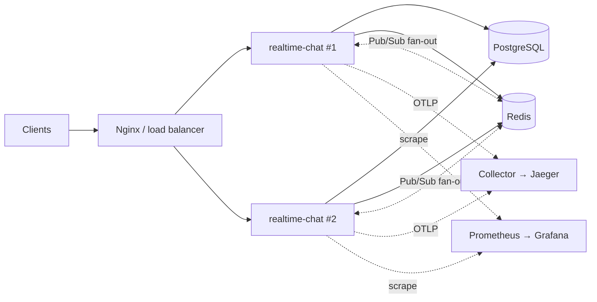
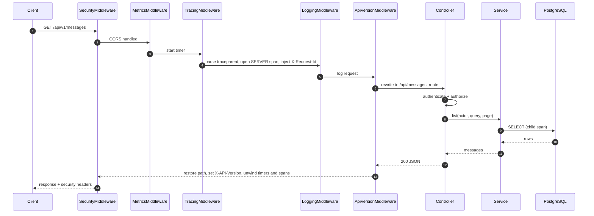
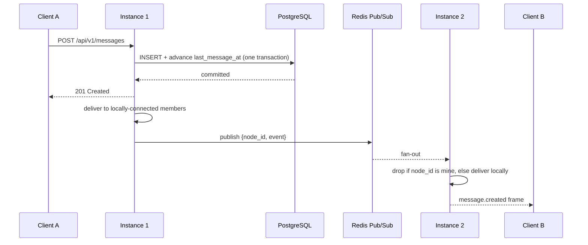

<div align="center">

# realtime-chat

**A distributed real-time messaging backend written in Modern C++20.**

Direct and group chat over REST and WebSockets, with the operational machinery a
real deployment needs: role-based access control, an append-only audit trail,
PostgreSQL full-text search, horizontal scaling over Redis Pub/Sub, and
distributed tracing.

[](https://github.com/devtejasx/realtime-chat-server/actions/workflows/ci.yml)
[](https://github.com/devtejasx/realtime-chat-server/actions/workflows/lint.yml)
[](https://github.com/devtejasx/realtime-chat-server/actions/workflows/codeql.yml)
[](https://github.com/devtejasx/realtime-chat-server/actions/workflows/security.yml)
[](https://github.com/devtejasx/realtime-chat-server/actions/workflows/docker.yml)


[Overview](#overview) · [Features](#features) · [Architecture](#architecture) ·
[Getting started](#getting-started) · [API](#api) · [Testing](#testing) ·
[Performance](#performance) · [Deployment](#deployment) · [Documentation](#documentation)

</div>

---

## Overview

realtime-chat is a single C++20 binary that serves REST and WebSockets over one
shared service layer, persists to PostgreSQL, and scales horizontally by fanning
real-time events across replicas through Redis Pub/Sub. REST controllers and
WebSocket handlers call the same services, so a message sent over either
transport takes exactly the same code path.

**The problem it solves.** A chat backend is deceptively hard to scale. A
WebSocket connection is pinned to whichever process accepted it, so the moment
you run more than one replica, a message persisted by replica 1 will never reach
a recipient connected to replica 2 unless something carries it across. On a
single replica that bug is invisible — local delivery reaches everyone, and a
completely dead cluster bus looks identical to a working one. This repository
treats that as the central design constraint rather than an afterthought: the
cluster bus is a first-class interface, `docker-compose.cluster.yml` exists
specifically to make the failure observable, and `/health/ready` reports whether
the instance is actually clustered.

**Design stance.** Every external dependency sits behind an interface with a
working default, so the system builds and runs with no infrastructure beyond
PostgreSQL, then scales out by swapping implementations — with no change to
business logic. Decisions that are easy to get wrong are documented where they
are made, in the code, with the reasoning: why roles are resolved from the
database rather than the JWT, why liveness probes must not touch dependencies,
why the WebSocket protocol is negotiated rather than unioned.

**Status.** Feature-complete and validated end to end — clean build, full test
suite, containerised two-instance cluster, Kubernetes deployment, and load tests.
The project version is set in `CMakeLists.txt` and surfaced at runtime on
`/health`; see [docs/Release.md](docs/Release.md) for how releases are cut.

## Features

### Authentication and sessions

| | |
| --- | --- |
| Password storage | bcrypt with CSPRNG salts; length capped at bcrypt's 72-byte limit rather than silently truncated |
| Tokens | JWT access/refresh pairs (HS256), verified for signature, issuer, expiry **and token type** |
| Sessions | Distributed; refresh tokens stored only as SHA-256 hashes and rotated on every refresh, so replay is rejected |
| Devices | Per-session listing and revocation, plus global logout |

### Messaging

| | |
| --- | --- |
| Conversations | One-to-one (deduplicated server-side) and group, with ownership, membership, rename, add/remove/leave |
| Messages | Send, edit, soft-delete, keyset pagination, per-conversation history |
| Reactions | Emoji reactions from a fixed palette, with live fan-out |
| Attachments | Multipart upload with magic-byte content-type verification, thumbnails, pluggable storage |
| Search | PostgreSQL full-text with `ts_rank_cd` ranking, `ts_headline` highlighting, and a trigram fuzzy fallback |
| Notifications | In-app feed plus a pluggable push-provider seam |

### Real-time

| | |
| --- | --- |
| Transport | WebSockets at `/api/v1/ws`, authenticated during the handshake so a bad token fails the upgrade |
| Protocol | Two negotiated versions; v1 is frozen, v2 adds correlation metadata |
| Events | Messages, typing indicators, presence, read and delivery receipts, reactions, notifications |
| Liveness | Application-level heartbeat with idle-connection reclamation |

### Distributed systems

| | |
| --- | --- |
| Fan-out | Redis Pub/Sub carries broadcasts, presence and cache invalidation across replicas |
| Loop suppression | Every published message is stamped with its origin node id so receivers drop their own |
| Session consistency | Sessions live in PostgreSQL, so any instance can serve any request |
| Readiness | `/health/ready` reports `cluster.distributed`, making a mis-scaled deployment visible |

### Security

| | |
| --- | --- |
| RBAC | `user` / `moderator` / `admin` / `super_admin` over a `constexpr` permission table |
| Revocation | Authorization is database-authoritative behind a short-TTL cache, so a ban or demotion applies on the next request rather than at token expiry |
| Rate limiting | Fixed-window limits on login, registration, messaging and uploads, shared across instances when Redis is the backend |
| Hardening | Security headers on success *and* error responses, explicit CORS, MIME allow-list, upload and body-size caps |
| Audit | Append-only, idempotent, correlated with the request and trace that caused it, searchable through the admin API |
| Configuration | Invalid configuration fails at startup, not at first use — including placeholder and weak `JWT_SECRET` values in production |

### Observability

| | |
| --- | --- |
| Metrics | Prometheus exposition at `/metrics`, with histogram buckets so `histogram_quantile` yields real p95/p99 |
| Tracing | W3C trace context propagated across Redis Pub/Sub and into background workers; OTLP/HTTP and Zipkin v2 exporters |
| Logging | Structured JSON carrying `trace_id`, `span_id` and `request_id` on every line, read from ambient context |
| Dashboards | A provisioned Grafana dashboard of 20 panels across 6 rows |
| Probes | `/health/live`, `/health/ready`, `/health/startup` — three probes answering three different questions |

### Reliability

| | |
| --- | --- |
| Circuit breakers | PostgreSQL and the cache fail fast instead of queueing behind a dead dependency; domain errors count as successes so user input cannot trip the breaker |
| Retry policy | Bounded exponential backoff with jitter and a mandatory retryable predicate |
| Degradation | A cache outage degrades to a miss, not a 500 |
| Durable messaging | A broker abstraction with retry ladder, dead-letter queue and poison-message handling |

### Administration

Users, groups, sessions, connected sockets, cache, background jobs, system
metrics, audit search, and eight runtime feature flags — all behind RBAC, with
role and feature-flag changes reserved for `super_admin`.

## Technology stack

| Concern | Choice |
| --- | --- |
| Language | C++20 |
| HTTP / WebSocket framework | [Crow](https://github.com/CrowCpp/Crow) (Asio transport) |
| Database | PostgreSQL 16 via [libpqxx](https://github.com/jtv/libpqxx) |
| Cache / Pub/Sub | Redis 7 via [redis-plus-plus](https://github.com/sewenew/redis-plus-plus) (optional at build time) |
| Messaging | In-process event bus; `IMessageBroker` abstraction with an in-memory implementation |
| Authentication | bcrypt · JWT via [jwt-cpp](https://github.com/Thalhammer/jwt-cpp) · OpenSSL |
| Serialisation | [nlohmann/json](https://github.com/nlohmann/json) |
| Logging | [spdlog](https://github.com/gabime/spdlog) |
| Observability | Prometheus · Grafana · Jaeger · OpenTelemetry-compatible tracing (OTLP/HTTP, Zipkin v2) |
| Build system | CMake ≥ 3.24 with FetchContent; Ninja recommended |
| Testing | GoogleTest · Google Benchmark · k6 |
| Containers | Docker · Docker Compose · Nginx |
| Orchestration | Kubernetes manifests (Deployment, Service, Ingress, ConfigMap, Secret, HPA, PDB, NetworkPolicy) |
| Cloud | Terraform for AWS (VPC, EC2, RDS, ElastiCache, IAM, security groups, ALB) |
| CI/CD | GitHub Actions — build & test, coverage, lint, CodeQL, secret scanning, image publish, tagged releases |

## Architecture

Dependencies point inward. The domain layer knows nothing about PostgreSQL, Crow
or Redis; services depend on interfaces the domain owns, and infrastructure
implements them. That is why the test suite exercises real service code with no
database at all.



The dotted Pub/Sub edges are load-bearing, for the reason given in
[Overview](#overview): without them, delivery across replicas is silently
partial.

### Request lifecycle

Middleware order is the interesting part. `ApiVersionMiddleware` is *innermost*:
it rewrites the path immediately before routing, then restores the original path
on the way out so logs and metrics report what the client actually asked for.



### Cross-instance delivery



Persist first, broadcast second: a client must never see a message the server
failed to store. Frames are at-most-once — a client that misses one recovers by
re-reading history from `GET /api/v1/messages`, which is the durable record.

**Ten diagrams** — system, layering, ERD, request lifecycle, authentication,
RBAC, WebSocket, event flow, cache, deployment — are in
[docs/Diagrams.md](docs/Diagrams.md). Layer-by-layer narrative is in
[docs/Architecture.md](docs/Architecture.md); the reasoning behind the choices,
including rejected alternatives, is in the
[ADRs](docs/adr/README.md).

## Repository layout

```
.
├── include/rtc/            # public headers, organised by layer
│   ├── config/             #   configuration loading and validation
│   ├── controllers/        #   HTTP/WebSocket adapters (no business logic)
│   ├── services/           #   business logic — the only place it lives
│   ├── repositories/       #   persistence interfaces + SQL implementations
│   ├── models/ dto/        #   domain types and transport shapes
│   ├── middlewares/        #   security, metrics, tracing, logging, versioning
│   ├── realtime/           #   sessions, rooms, connections, presence, cluster bus
│   ├── events/             #   typed domain events and the in-process bus
│   ├── messaging/          #   durable broker abstraction
│   ├── reliability/        #   circuit breaker and retry policy
│   ├── cache/ ratelimit/   #   pluggable cache store and fixed-window limiter
│   ├── security/           #   password hashing, JWT, RBAC tables
│   ├── tracing/ metrics/   #   spans, exporters, Prometheus registry
│   ├── jobs/ storage/      #   background executor/scheduler, file storage seam
│   └── docs/               #   the compiled-in OpenAPI document
├── src/                    # implementation, mirroring include/
├── tests/                  # GoogleTest suite (44 files) + fakes under support/
├── benchmarks/             # Google Benchmark microbenchmarks (opt-in)
├── loadtest/               # k6 scenarios: auth, messaging, websocket, upload
├── migrations/             # 13 forward-only SQL migrations
├── cmake/                  # centralised dependency resolution
├── docker/                 # dev and production Dockerfiles
├── nginx/                  # reverse proxy: TLS, security headers, WS upgrade
├── deploy/
│   ├── k8s/                #   Kubernetes manifests
│   ├── terraform/          #   AWS infrastructure as code
│   ├── grafana/ prometheus/#   dashboards and scrape configuration
│   ├── aws/                #   EC2 deploy / rollback / health-check scripts
│   └── systemd/            #   hardened service unit
├── scripts/                # build, test, run, format, coverage, db, ssl helpers
└── docs/                   # architecture, diagrams, API, operations, ADRs
```

## Getting started

### Prerequisites

A C++20 compiler (GCC 12+ or Clang 15+), CMake ≥ 3.24, Ninja (optional), and the
PostgreSQL and OpenSSL development headers. Everything else — Crow, libpqxx,
spdlog, jwt-cpp, bcrypt, GoogleTest — is fetched by CMake at configure time, so
the first configure needs network access.

```bash
sudo apt-get install -y build-essential cmake ninja-build git libssl-dev libpq-dev
```

`postgresql-server-dev-all` is **not** required; this is a libpq client.

### Clone

```bash
git clone https://github.com/devtejasx/realtime-chat-server.git
```

### Run everything with Docker

Requires only Docker. Brings up PostgreSQL and the server, applies migrations on
startup, and serves on `http://localhost:8080`:

```bash
docker compose up --build
```

### Build from source

Configure and build in Release (pass `Debug` for a debug build):

```bash
./scripts/build.sh
```

Build and run the full test suite. Note that this reconfigures `build/` as
**Debug** — run `./scripts/build.sh` again afterwards if you want an optimised
binary back:

```bash
./scripts/test.sh
```

Run the server — it needs a reachable PostgreSQL, which `docker-compose.yml`
provides:

```bash
cp .env.example .env && ./scripts/run.sh
```

### Verify it is alive

```bash
curl http://localhost:8080/health
```

```json
{"environment":"development","service":"realtime-chat","status":"ok","version":"0.1.0"}
```

Then register a user and send a message:

```bash
curl -sX POST localhost:8080/api/v1/auth/register -H 'Content-Type: application/json' -d '{"username":"ada","email":"ada@example.com","password":"correct-horse-battery"}'
```

| What | Where |
| --- | --- |
| Interactive API reference (Swagger UI) | <http://localhost:8080/docs> |
| OpenAPI 3.1 document | <http://localhost:8080/openapi.json> |
| Prometheus metrics | <http://localhost:8080/metrics> |
| Health probes | `/health`, `/health/live`, `/health/ready`, `/health/startup` |

### More than one instance

A single server cannot demonstrate horizontal scaling. Two servers behind Nginx,
each also addressable directly:

```bash
docker compose -f docker-compose.cluster.yml up --build
```

| | |
| --- | --- |
| `localhost:8080` | Nginx, round-robin across both |
| `localhost:8081` / `:8082` | Server A / B directly |

Connect a WebSocket to one, send a message through the other, and watch it
arrive. `curl -s localhost:8081/health/ready` reports whether that instance is
actually clustered — `"distributed": false` on a multi-replica deployment means
delivery is partial right now, silently. Walkthrough in
[docs/Deployment.md](docs/Deployment.md#running-more-than-one-instance).

### With dashboards and traces

Overlays Prometheus, Grafana and Jaeger onto the two-instance stack:

```bash
docker compose -f docker-compose.cluster.yml -f docker-compose.observability.yml up --build
```

| | |
| --- | --- |
| `localhost:3000` | Grafana, opening on the dashboard |
| `localhost:9090` | Prometheus |
| `localhost:16686` | Jaeger — one trace should span both instances |

### Build options

| Option | Default | Purpose |
| --- | --- | --- |
| `RTC_BUILD_TESTS` | `ON` | GoogleTest suite |
| `RTC_BUILD_BENCHMARKS` | `OFF` | Google Benchmark suite (fetches an extra dependency) |
| `RTC_WITH_REDIS` | `OFF` | Redis cache and cluster bus — **required for more than one replica** |
| `RTC_ENABLE_COVERAGE` | `OFF` | gcov/lcov instrumentation (use with `Debug`) |
| `RTC_ENABLE_WARNINGS` | `ON` | Strict warning set |
| `RTC_WARNINGS_AS_ERRORS` | `OFF` | Promote warnings to errors |

## Configuration

Every setting comes from an environment variable and has a development default;
[`.env.example`](.env.example) documents the full list. Invalid configuration
fails at startup rather than at first use.

**Required in production** — the server refuses to boot otherwise:

| Variable | Rule |
| --- | --- |
| `JWT_SECRET` | ≥ 32 bytes, not the shipped development default, and not a `REPLACE_ME` placeholder |
| `DB_HOST` / `DB_NAME` / `DB_USER` | Must be non-empty |

**Most worth knowing:**

| Variable | Default | Notes |
| --- | --- | --- |
| `CHAT_PORT` | `8080` | Listen port |
| `DB_POOL_SIZE` | `8` | Per instance; keep `instances × pool_size` under Postgres `max_connections` |
| `REDIS_ENABLED` | `false` | Shared cache; needs a `-DRTC_WITH_REDIS=ON` build |
| `CLUSTER_ENABLED` | follows `REDIS_ENABLED` | **Required with more than one replica** |
| `AUTHZ_CACHE_TTL_SECONDS` | `30` | Worst-case delay before a ban or demotion takes effect |
| `RATE_LIMIT_ENABLED` | `true` | Window and per-action budgets are separately configurable |
| `TRACING_ENABLED` | `false` | With `TRACING_EXPORTER` = `logging` / `otlp` / `zipkin` |
| `LOG_LEVEL` / `LOG_FORMAT` | `info` / `text` | Production images default to `json` |
| `ENABLE_*` | `true` | Eight feature flags, also togglable at runtime by a super admin |

**Production notes.** Narrow `CORS_ALLOWED_ORIGINS` from `*`. Source secrets from
a secret manager rather than files — the Terraform provisions an AWS Secrets
Manager entry. Pin the image to a digest or immutable tag so rollback means
something.

## API

The live reference is **Swagger UI at `/docs`**, backed by the OpenAPI 3.1
document at `/openapi.json`, which is compiled into the binary and asserted
against the DTOs by a contract test.

Every endpoint is reachable at both `/api/v1/...` (canonical) and the
unversioned `/api/...` (a permanently supported alias). Both are real registered
routes bound to the same handler — not a redirect and not a rewrite. Responses
carry `X-API-Version`; an unsupported version returns a machine-readable
`unsupported_api_version` error naming the versions this build serves.

| Area | Endpoints |
| --- | --- |
| Authentication | `POST /auth/register`, `/auth/login`, `/auth/refresh`, `/auth/logout`, `/auth/logout-all` · `GET /auth/me` |
| Users | `GET`/`PUT /users/me` · `GET /users/{id}` |
| Conversations | `POST`/`GET /conversations` · `GET`/`DELETE /conversations/{id}` · `PATCH /conversations/{id}/name` · `POST`/`DELETE /conversations/{id}/members…` · `POST /conversations/{id}/leave` |
| Messages | `POST`/`GET /messages` · `PATCH`/`DELETE /messages/{id}` |
| Reactions | `POST`/`GET`/`DELETE /messages/{id}/reactions` |
| Attachments | `POST /attachments` · `GET`/`DELETE /attachments/{id}` · `GET /attachments/{id}/thumbnail` |
| Notifications | `GET /notifications` · `POST /notifications/{id}/read` · `POST /notifications/read-all` · `DELETE /notifications/{id}` |
| Sessions | `GET /sessions` · `DELETE /sessions/{id}` |
| Search | `GET /search/messages?q=…` |
| Admin | `/admin/users…`, `/admin/conversations/{id}`, `/admin/websockets`, `/admin/cache`, `/admin/jobs`, `/admin/system`, `/admin/audit-logs`, `/admin/features` |
| WebSocket | `GET /ws?token=…&protocol=2` |
| Operations | `GET /health`, `/health/live`, `/health/ready`, `/health/startup`, `/metrics`, `/docs`, `/openapi.json` |

Failures share one envelope with a stable, machine-readable `code`:

```json
{ "error": { "code": "validation_error", "message": "Username is required", "details": "field=username" } }
```

**WebSocket.** Connect to `/api/v1/ws?token=<access_token>&protocol=2`.
Authentication happens during the handshake, so an invalid token produces a
failed upgrade rather than an open socket that later errors. Version negotiation
happens once, at the handshake — v1 is frozen, v2 adds `request_id` and
`correlation_id`. A malformed frame produces an `error` frame rather than
closing the socket.

Full details: [docs/API.md](docs/API.md) ·
[docs/WebSocketProtocol.md](docs/WebSocketProtocol.md) ·
[docs/Authorization.md](docs/Authorization.md)

## Major components

| Component | Behaviour worth knowing |
| --- | --- |
| **Authentication** | bcrypt + JWT. Access tokens are short-lived; refresh requires both the refresh token and its session id, and rotation invalidates the old one. |
| **RBAC** | Four roles over a `constexpr` permission bitset. A caller may never grant a role at or above their own tier. Role and feature-flag changes require `super_admin`. |
| **Conversations** | Direct conversations are deduplicated by a stable participant key, so creating one twice returns the same row. |
| **Messages** | Insert and `last_message_at` advance in one transaction. Deletes are soft; the row remains. Keyset pagination stays fast at any depth. |
| **Presence** | Online on the first session, offline on the last. Shared across replicas through Redis when clustered. |
| **Typing indicators** | Never persisted; delivered to room members excluding the sender. |
| **Read receipts** | A high-water mark per conversation, not per message. |
| **Notifications** | Written through the domain event bus, so the delivery path is decoupled from the write path. |
| **Search** | Scoped to conversations the caller participates in — enforced in SQL, not in the service. |
| **Caching** | `ICacheStore` with an in-memory default and a Redis implementation. A cache outage degrades to a miss. |
| **Cluster bus** | `IClusterBus`; the null implementation is the *correct* choice for a single replica, not merely a fallback. |
| **Rate limiting** | Fixed window over the cache's atomic INCR, so limits are shared across instances when Redis backs it. Login is counted before the credential check. |
| **Background jobs** | Fixed-size worker pool plus a periodic scheduler. Trace context and request id hop from the submitting thread to the worker. |
| **Observability** | Metrics, tracing and logging share one ambient context, so a log line in a repository that knows nothing about HTTP is still joinable to its trace. |

## Testing

```bash
./scripts/test.sh
```

Or against an existing build:

```bash
ctest --test-dir build --output-on-failure
```

A default build registers **413 tests** across two CTest labels. Building with
`-DRTC_BUILD_BENCHMARKS=ON` adds a third label and one more test, for 414. The
badge at the top of this page is the default figure; it is static, so reproduce
it rather than trust it.

| Label | Count | What it covers |
| --- | --- | --- |
| `unit` | 406 | Config, validation, security, every service, realtime managers, DTO/OpenAPI contract, RBAC, tracing, reliability primitives, broker semantics, and HTTP-level routing through the real Crow router in-process |
| `live` | 7 | A real listening socket — the only way to exercise Crow's global middleware chain, including prefix parity between `/api` and `/api/v1` |
| `benchmark` | 1 | Only with `RTC_BUILD_BENCHMARKS=ON`: a smoke pass proving the microbenchmarks still execute (not a performance gate) |

Select a subset with `ctest -L unit` or exclude the socket-bound suite with
`ctest -LE live`.

**Database integration tests** are opt-in and report as *skipped* without them,
so the default run stays green with no infrastructure:

```bash
RTC_RUN_DB_TESTS=1 DB_HOST=localhost DB_PORT=5432 ctest --test-dir build --output-on-failure
```

Seven tests move from skipped to executed; they run the real migration runner
against PostgreSQL. CI runs with them enabled.

**Cluster and WebSocket coverage** lives in the unit suite via injected fakes
(`distributed_presence_test`, `cluster_broadcast_test`, `ws_protocol_test`,
`trace_propagation_test`), and end to end against the two-instance Compose stack.

**Benchmarks** (opt-in, Release only — a Debug build measures the absence of the
optimiser):

```bash
cmake -S . -B build -DCMAKE_BUILD_TYPE=Release -DRTC_BUILD_BENCHMARKS=ON && cmake --build build --parallel && ./build/bin/rtc_benchmarks
```

Database benchmarks additionally require `BENCH_DB=1` and a reachable PostgreSQL.

**Load tests** (k6). Disable rate limiting first, or the limiter is what you
measure:

```bash
RATE_LIMIT_ENABLED=false docker compose -f docker-compose.cluster.yml up -d --build
```

```bash
k6 run --env BASE_URL=http://localhost:8080 loadtest/messaging.js
```

Without k6 installed, the official image works against the Compose network:

```bash
docker run --rm --network realtime-chat_default -v "$PWD/loadtest:/scripts:ro" -e BASE_URL=http://balancer:8080 grafana/k6 run /scripts/messaging.js
```

Scenarios: `auth.js`, `messaging.js`, `websocket.js`, `upload.js`. Details in
[loadtest/README.md](loadtest/README.md).

**Coverage.** CI measures line coverage with `lcov` and publishes it as a build
artifact; no coverage service is wired up, which is why no percentage is claimed
above. Locally (requires `lcov`, and a `Debug` build — optimised code makes line
attribution fiction):

```bash
./scripts/coverage.sh --open
```

## Performance

Measured figures, and the conditions that produced them, are in
[docs/performance/results-2026-08-06.md](docs/performance/results-2026-08-06.md).
That run was taken on a developer laptop with the load generator, both app
instances, PostgreSQL, Redis and the observability stack sharing one 16-thread
machine — so it establishes correctness under load rather than deployable
capacity. Read its *Known distortions* section before quoting anything from it.

Headline results from that run:

| | |
| --- | --- |
| Requests served across two instances | 91,220 with **zero 5xx** |
| Messaging | ~242 req/s sustained, 0 errors in 87,683 requests |
| Authentication | ~65 req/s, CPU-bound on bcrypt |
| WebSocket fan-out | 9.7M frames delivered (~25k/s) from 59.5k sends |
| Upload / search | p95 22ms / 10ms, all thresholds met |
| Cluster bus | ~442k published, ~434k received, 0 dropped events |

The limiting resources were **PostgreSQL for messaging** (~492% CPU against
~260% for both app servers combined) and **bcrypt for authentication** — two
different ceilings with two different remedies, and neither is the application
layer. Under saturation the service got slower; it did not get wrong.

A run on dedicated hardware is still wanted. The methodology and the results
template are in [docs/performance/](docs/performance/README.md); design targets
and tuning knobs are in [docs/Performance.md](docs/Performance.md).

## Monitoring

| | |
| --- | --- |
| **Prometheus** | `/metrics` in text exposition format. Scrape config in [deploy/prometheus/](deploy/prometheus/prometheus.yml). Metric names are coerced into the Prometheus grammar at the registry, so a name composed from runtime data cannot break a scrape. |
| **Grafana** | A provisioned dashboard of 20 panels across 6 rows in [deploy/grafana/](deploy/grafana/dashboards/), every query checked against a metric the binary emits. |
| **Tracing** | W3C `traceparent` in and out. Context follows a request across Redis Pub/Sub and into background workers, so one trace id spans the whole lifecycle. Exporters: `logging`, OTLP/HTTP, Zipkin v2. |
| **Logging** | JSON with `trace_id`, `span_id` and `request_id` on every line. Send `X-Request-Id` to correlate your request with server logs, or read the one the server generates. |
| **Health** | `/health/live` never touches a dependency — a liveness probe that queried PostgreSQL would restart every replica during a database blip. `/health/ready` does check dependencies, and reports cluster status. `/health/startup` releases the Kubernetes startup probe once migrations are applied and background threads are live. |

Details, including the alerting rules worth having, are in
[docs/Monitoring.md](docs/Monitoring.md).

## Deployment

| Target | Where |
| --- | --- |
| Docker / Compose | [docs/Docker.md](docs/Docker.md) |
| Kubernetes | [deploy/k8s/](deploy/k8s/README.md) |
| AWS (Terraform) | [deploy/terraform/](deploy/terraform/README.md) |
| AWS (scripts) | [docs/AWS.md](docs/AWS.md) |
| systemd | [deploy/systemd/](deploy/systemd/) |

The full production stack — PostgreSQL, Redis, the app and Nginx with TLS — is
one command:

```bash
export JWT_SECRET="$(openssl rand -hex 32)" DB_PASSWORD="$(openssl rand -hex 16)" && docker compose -f docker-compose.prod.yml up -d --build
```

Certificates come from `DOMAIN=… EMAIL=… ./scripts/ssl/init-letsencrypt.sh`.

**Kubernetes.** Fourteen resources across ten manifests: Namespace (with Pod
Security Admission labels), ConfigMap, Secret template, Deployment,
ServiceAccount, ClusterIP and headless Services, two Ingresses (the second denies
`/metrics` from outside), HPA, PodDisruptionBudget, NetworkPolicy, plus a Redis
Deployment and Service.

```bash
kubectl apply -f deploy/k8s/namespace.yaml
```

```bash
kubectl -n realtime-chat apply -f deploy/k8s/
```

Pods run non-root with a read-only root filesystem and `RuntimeDefault` seccomp;
the rollout uses `maxUnavailable: 0`, so a misconfigured revision cannot take
down a serving deployment. Read the checklist in
[deploy/k8s/README.md](deploy/k8s/README.md) before going live — in particular,
replace every `REPLACE_ME` in `secret.yaml` and pin the image tag. The manifests
assume a managed PostgreSQL; no database is deployed for you.

**CI/CD.** Six GitHub Actions workflows:

| Workflow | What it does |
| --- | --- |
| `ci.yml` | Build and test on Ubuntu 24.04 with database integration tests enabled, plus an `lcov` coverage job |
| `lint.yml` | `clang-format` check and `clang-tidy` |
| `codeql.yml` | CodeQL analysis on push and weekly |
| `security.yml` | gitleaks secret detection and dependency review |
| `docker.yml` | Builds and publishes the container image |
| `release.yml` | Builds artifacts and publishes a GitHub release on a `v*` tag |

Operational guidance, the readiness checklist and the runbook are in
[docs/Deployment.md](docs/Deployment.md).

## Security

| Area | Implementation |
| --- | --- |
| **Authentication** | bcrypt password hashing; JWT verified for signature, issuer, expiry and token type |
| **Sessions** | Refresh tokens stored as SHA-256 hashes, rotated on use; replay rejected |
| **Authorization** | RBAC over a `constexpr` permission table; database-authoritative so revocation is prompt |
| **Rate limiting** | Login, registration, messaging and uploads; login counted before the credential check so guessing is throttled |
| **Input validation** | Explicit validators at the DTO boundary; every failure returns the same error envelope |
| **SQL injection** | All queries parameterised through libpqxx `exec_params`; no user data is concatenated into SQL |
| **Secure headers** | `X-Content-Type-Options`, `X-Frame-Options`, `Referrer-Policy`, `X-XSS-Protection: 0` and CSP, applied by the app *and* Nginx, on success and error responses alike |
| **Transport** | TLS 1.2+ at Nginx with modern ciphers, HSTS, OCSP stapling, HTTP→HTTPS redirect |
| **Audit logs** | Append-only and idempotent, correlated with request and trace, searchable via the admin API |
| **Secrets** | Never logged; connection strings redacted in output. Terraform provisions AWS Secrets Manager; Kubernetes reads from a Secret |
| **Supply chain** | CodeQL, secret scanning, and pinned dependency tags in `cmake/dependencies.cmake` |

Full posture, including the threat model and what is deliberately out of scope:
[docs/Security.md](docs/Security.md).

## Documentation

**Design** — [Architecture](docs/Architecture.md) · [Diagrams](docs/Diagrams.md) ·
[Database](docs/Database.md) · [Decision records](docs/adr/README.md)

**Interfaces** — [API](docs/API.md) ·
[WebSocket protocol](docs/WebSocketProtocol.md) ·
[Authorization & audit](docs/Authorization.md)

**Operations** — [Deployment](docs/Deployment.md) · [Docker](docs/Docker.md) ·
[Kubernetes](deploy/k8s/README.md) · [Terraform](deploy/terraform/README.md) ·
[AWS](docs/AWS.md) · [Monitoring](docs/Monitoring.md) ·
[Reliability](docs/Reliability.md) · [Troubleshooting](docs/Troubleshooting.md)

**Performance** — [Method and results](docs/performance/README.md) ·
[Design targets](docs/Performance.md) · [Load testing](loadtest/README.md)

**Project** — [Security](docs/Security.md) · [Contributing](docs/Contributing.md) ·
[Release process](docs/Release.md)

## Roadmap

Genuine gaps, not completed work. Each has a seam already in place, which is what
makes it tractable rather than speculative.

- **External broker transport.** `IMessageBroker` defines the retry ladder,
  dead-letter queue and poison handling; only the in-memory implementation
  exists. A RabbitMQ or Kafka adapter would satisfy the same interface. See
  [ADR-0009](docs/adr/0009-durable-message-broker.md).
- **Object storage for attachments.** `IFileStorage` has one implementation,
  `LocalFileStorage`. With more than one replica an attachment uploaded to one
  pod is invisible to the others, so S3/Azure/GCS is required for durable
  multi-replica uploads.
- **Push notification providers.** The dispatcher and provider seam exist; no
  FCM/APNs/email/SMS provider is implemented.
- **Performance run on dedicated hardware.** The recorded figures come from a
  laptop; capacity planning needs a controlled host.
- **Multi-region deployment.** The current topology is single-region with one
  PostgreSQL primary.
- **Read replicas and connection pooling at scale.** PostgreSQL was the measured
  ceiling for messaging; PgBouncer and read replicas are the documented next step.

## Contributing

Contributions are welcome. The short version:

```bash
./scripts/build.sh          # configure + build
./scripts/test.sh           # build + run the full suite
./scripts/format.sh         # clang-format, enforced in CI
```

**Architecture rules.** Business logic lives only in services; controllers and
WebSocket handlers are thin adapters, and repositories contain only SQL. Depend
on interfaces, not concretes, and wire implementations in the single composition
root. REST and WebSocket must call the same services — never duplicate logic.

**Standards.** Formatting is enforced by `.clang-format` (Google base, C++20, 100
columns). `.clang-tidy` runs in CI as advisory. Prefer RAII, smart pointers,
`std::optional`, `std::string_view`, move semantics, `constexpr` and `enum class`;
avoid raw `new`/`delete` and global mutable state. Match the surrounding style and
comment density — comments here explain *why*, not *what*.

**Pull requests.** Keep them focused, include tests for behaviour changes, and
make sure build, tests, lint, CodeQL and the security workflow are green. Full
guide: [docs/Contributing.md](docs/Contributing.md).

## License

Released under the MIT License. See [LICENSE](LICENSE).
