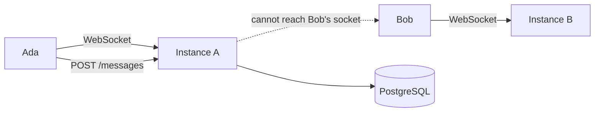
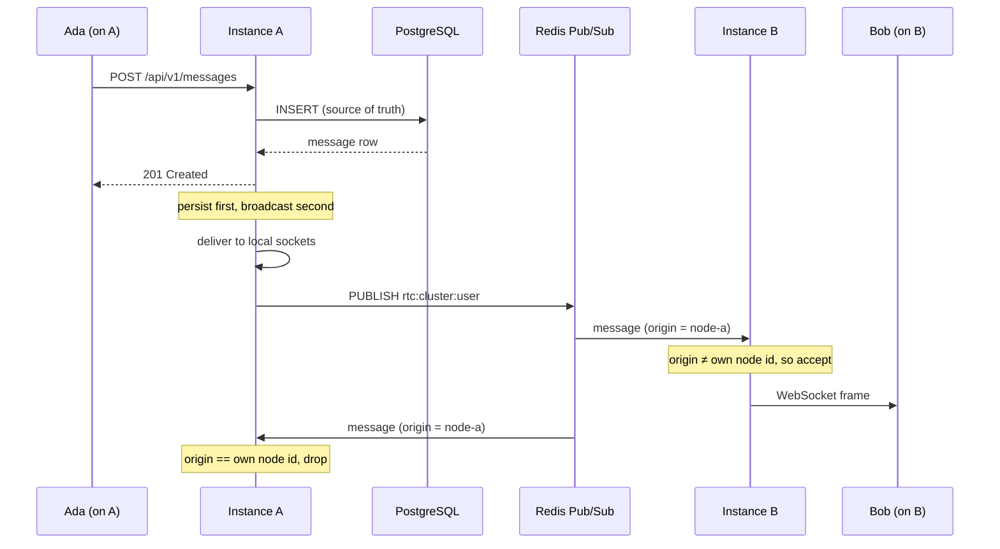
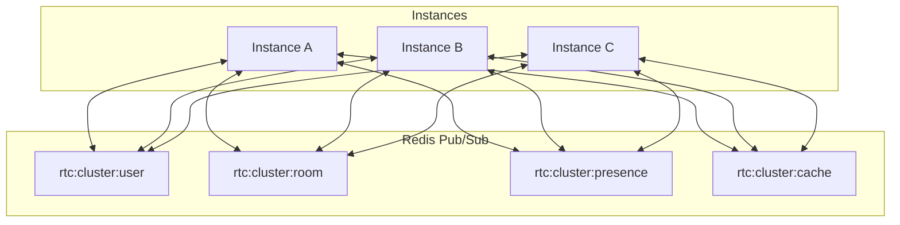
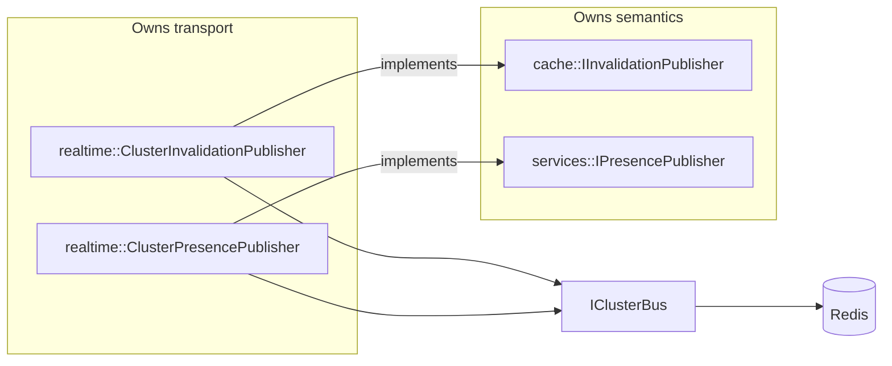
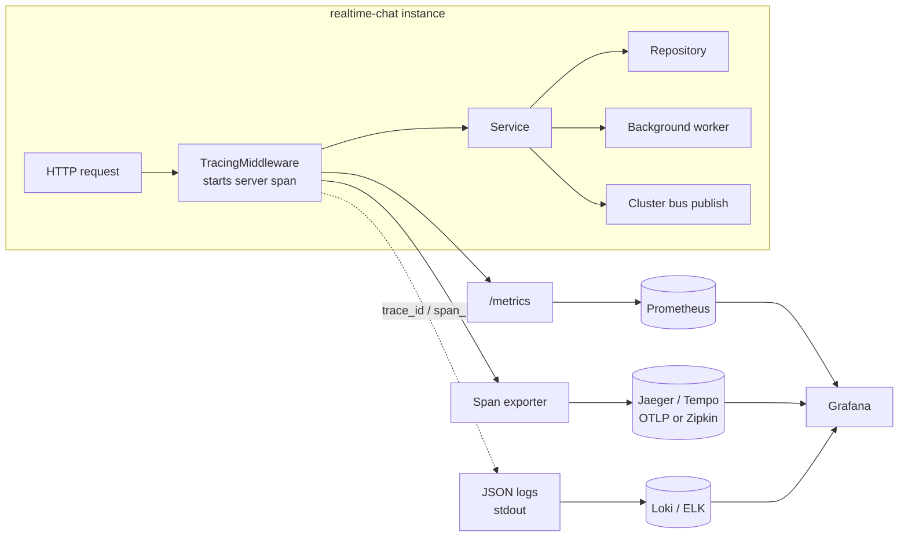
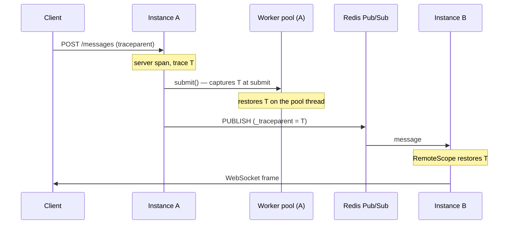

# Architecture

realtime-chat follows a layered **clean architecture**. Dependencies point
inward: outer layers (HTTP) depend on inner layers (domain), never the reverse.
Concrete implementations are bound to interfaces in a single composition root,
so every component is independently testable.

## Layers

```
            ┌─────────────────────────────────────────────┐
  HTTP      │  Controllers  ·  Middlewares  ·  DTOs        │
            └───────────────┬─────────────────────────────┘
                            │ depends on
            ┌───────────────▼─────────────────────────────┐
  Domain    │  Services  (business logic)                  │
            └───────────────┬─────────────────────────────┘
                            │ depends on (interfaces)
            ┌───────────────▼─────────────────────────────┐
  Data      │  Repositories  ·  Models                     │
            └───────────────┬─────────────────────────────┘
                            │ depends on
            ┌───────────────▼─────────────────────────────┐
  Infra     │  Database (pool, migrations) · Security      │
            │  Config · Logging · Errors · Utils           │
            └─────────────────────────────────────────────┘
```

### Responsibilities

| Layer            | Contains                              | Must **not** contain            |
| ---------------- | ------------------------------------- | ------------------------------- |
| **Controllers**  | HTTP parsing, status codes, headers   | business rules, SQL             |
| **Middlewares**  | cross-cutting HTTP concerns (auth, logging) | business rules            |
| **DTOs**         | request/response shapes, (de)serialisation | persistence, logic         |
| **Services**     | business logic, orchestration         | HTTP, SQL                       |
| **Repositories** | database operations, row mapping      | business rules, HTTP            |
| **Models**       | domain entities (plain data)          | behaviour                       |
| **Infra**        | config, logging, errors, pool, hashing, JWT | domain logic              |

The rule enforced throughout: **business logic lives only in services**;
**repositories contain only database operations**; **controllers contain only
HTTP handling**.

## Directory ↔ layer mapping

| Path                          | Layer / role                        |
| ----------------------------- | ----------------------------------- |
| `include/rtc/config`          | configuration                       |
| `include/rtc/logging`         | structured logging (spdlog facade)  |
| `include/rtc/errors`          | exception hierarchy + HTTP mapper   |
| `include/rtc/utils`           | env, time helpers                   |
| `include/rtc/security`        | password hashing, JWT tokens        |
| `include/rtc/database`        | connection pool, base repo, migrations |
| `include/rtc/models`          | domain entities                     |
| `include/rtc/dto`             | data-transfer objects               |
| `include/rtc/validation`      | input validation                    |
| `include/rtc/repositories`    | persistence interfaces + PG impls   |
| `include/rtc/services`        | business logic                      |
| `include/rtc/middlewares`     | auth guard, request logging         |
| `include/rtc/controllers`     | HTTP endpoints                      |
| `include/rtc/http`            | Crow app type, response helpers     |
| `include/rtc/application.hpp` | composition root                    |

## Dependency injection

`rtc::Application` is the **composition root**. It is the only place that:

1. constructs concrete implementations (`BcryptPasswordHasher`,
   `JwtTokenService`, `PgUserRepository`), and
2. injects them, via interfaces, into the components that need them.

```
Config ─► Application
             ├─ ConnectionPool
             ├─ IPasswordHasher   ← BcryptPasswordHasher
             ├─ ITokenService     ← JwtTokenService
             ├─ IUserRepository   ← PgUserRepository(pool)
             ├─ UserService(repo, hasher)
             ├─ AuthService(userService, tokenService)
             ├─ AuthMiddleware(tokenService)
             ├─ HealthController(config)
             └─ AuthController(authService, userService, authGuard)
```

Because services depend on **interfaces** (`IUserRepository`,
`IPasswordHasher`, `ITokenService`), unit tests substitute in-memory fakes with
no database or crypto cost.

## Request lifecycle

For `POST /api/auth/register`:

1. **LoggingMiddleware** logs the inbound request and starts a timer.
2. **AuthController** parses the JSON body into a `RegisterRequest` DTO
   (structural validation → `400` on malformed input).
3. **AuthService** validates + normalises the DTO, then delegates to
   **UserService**.
4. **UserService** hashes the password (`IPasswordHasher`) and calls
   **PgUserRepository** to insert the row.
5. **PgUserRepository** runs the SQL inside a transaction (via `BaseRepository`),
   translating a unique-constraint violation into a `ConflictException` (`409`).
6. **AuthService** mints an access/refresh token pair (`ITokenService`) and
   builds an `AuthResponse`.
7. The controller serialises the response (`201`).
8. **LoggingMiddleware** logs the response and elapsed time.

Any exception thrown along the way is caught by `run_guarded`, which maps it to
a consistent JSON error via `ErrorMapper` (see below).

## Error handling

- A typed hierarchy rooted at `AppException` carries an `ErrorType`, an HTTP
  status, a stable machine `code`, a message, and optional client-safe details.
- `run_guarded` wraps every handler body: `AppException` → its declared status
  (logged at warn); any other `std::exception` → a masked `500` (logged at
  error, message never leaked).
- `ErrorMapper` renders the canonical envelope:

  ```json
  { "error": { "code": "validation_error", "message": "...", "details": "..." } }
  ```

## Concurrency model

Crow serves requests on a thread pool. Shared state is limited to the
`ConnectionPool`, which is fully synchronised (mutex + condition variable);
leases are handed out per request and returned via RAII. Services and
repositories are stateless beyond their injected collaborators, so they are safe
to share across threads.

## Design principles applied

- **SOLID** — interfaces at every seam; single-responsibility layers.
- **DRY** — one error envelope, one transaction helper, one response helper.
- **RAII** — connection leases, env guards, logger lifetime.
- **Fail fast** — invalid configuration aborts startup with a clear message.

---

## Real-time layer (Phase 2)

Phase 2 adds WebSockets alongside the existing REST surface. The guiding rule is
unchanged: **all business logic lives in services**. REST controllers and
WebSocket handlers are both thin adapters that call the *same* service methods,
so messaging behaviour is defined once.

### Components (`include/rtc/realtime`)

| Component            | Responsibility                                             |
| -------------------- | ---------------------------------------------------------- |
| `SessionManager`     | thread-safe `connection ↔ user` registry (dual-indexed)    |
| `RoomManager`        | `conversation ↔ connections` routing cache for fan-out     |
| `ConnectionManager`  | owns the two registries; **implements `IEventBroadcaster`**|
| `EventDispatcher`    | decodes `{type,data}` frames → service calls; lifecycle    |
| `HeartbeatMonitor`   | background ping / idle-timeout sweep                       |
| `PresenceService`    | reference-counted online/offline + last-seen (in `services`) |

### The broadcaster seam

Services never depend on the WebSocket layer. They depend on the
`realtime::IEventBroadcaster` interface and call `publish(user_ids, type, data)`
after persisting. `ConnectionManager` implements that interface; a
`NullEventBroadcaster` is used where realtime is disabled (unit tests). This is
what lets a REST `POST /api/messages` and a WebSocket `message.send` produce
identical broadcasts — they run the same `MessageService::send`.

### Persist-first, broadcast-second

Every state-changing realtime action follows the same order inside the service:

1. validate,
2. **persist** (durability before delivery),
3. **broadcast** to participants via the injected broadcaster.

A crash between 2 and 3 loses only a notification, never data; clients reconcile
via the REST list endpoints.

### Connection lifecycle

```
handshake ──onaccept──► verify JWT (query token / Authorization) ─► accept/reject
   │
 onopen ──► register session ─► join conversation rooms ─► presence: online ─► "ready"
   │
onmessage ──► touch activity ─► dispatch (ping/typing/send/mark_*) ─► service ─► broadcast
   │
 onclose ──► unregister session ─► leave all rooms ─► presence: offline (if last session)
```

### Concurrency & performance

- All realtime registries use fine-grained mutexes and O(1) hash lookups,
  sized for thousands of concurrent connections.
- Presence is reference-counted so multi-device users report "offline" only when
  their last session closes.
- Typing indicators route through `RoomManager` (no DB) and are never persisted.
- Message/receipt writes reuse the pooled connections and prepared,
  fixed-shape SQL from the repository layer.
- Broadcast payloads are serialised **once** and delivered to every target
  session.

---

## Production & scalability layer (Phase 3)

Phase 3 makes the service horizontally scalable and production-ready while
preserving the layering: new capabilities are added as **interfaces with default
implementations**, injected in the composition root, so business logic never
changes when a backend is swapped.

### New abstractions (and their default vs. pluggable impls)

| Seam                    | Default (no deps)        | Pluggable alternative        |
| ----------------------- | ------------------------ | ---------------------------- |
| `cache::ICacheStore`    | `InMemoryCacheStore`     | `RedisCacheStore` (`-DRTC_WITH_REDIS`) |
| `storage::IFileStorage` | `LocalFileStorage`       | S3 / Azure / GCS             |
| `media::IImageProcessor`| `NoopImageProcessor`     | stb_image / libvips          |
| `notifications::IPushProvider` | `NullPushProvider`| FCM / APNs / email / SMS     |
| `notifications::INotificationDispatcher` | `NullNotificationDispatcher` | `NotificationDispatcher` |

### Cross-cutting infrastructure

- **CacheService** — namespaced, JSON, read-through, with hit/miss metrics.
- **PresenceCache** — fleet-wide online tracking over the shared store.
- **RateLimiter** — fixed-window limits over `ICacheStore` (per user/IP).
- **BackgroundExecutor** / **PeriodicScheduler** — off-request work (thumbnails,
  push, cache purge, expired-session cleanup).
- **MetricsRegistry** — Prometheus exposition at `GET /metrics`.
- **SecurityMiddleware** / **MetricsMiddleware** — global headers/CORS and
  request timing, added to the Crow middleware stack.

### Event-driven notifications

Domain services (message, conversation, reaction) announce events through the
`INotificationDispatcher` seam **after** they persist and broadcast. The
concrete dispatcher turns events into persisted, delivered notifications via
`NotificationService`, which fans out in-app over WebSocket and dispatches
external push on the background executor. Producers stay decoupled from delivery
policy, and every handler is `noexcept` so notifications never disrupt the
originating operation.

### Distributed sessions

`SessionService` records each login as a session (refresh token stored only as a
SHA-256 hash), supports rotation on refresh (old token rejected — replay
protection), and revocation of one or all sessions. The `sessions` table is the
source of truth; Redis can cache active-session lookups across instances.

### Scaling model

App instances are stateless: durable state in PostgreSQL, shared ephemeral state
in Redis. This supports multi-instance deployment behind a load balancer,
targeting 100k+ users and 10k+ concurrent WebSocket connections. See
[Deployment.md](Deployment.md).

## Horizontal scaling (Phase 5.1)

### The problem a second replica creates

A WebSocket connection is pinned to whichever instance accepted it. That is not
a design choice — it is a TCP connection to one process. So the moment there are
two replicas, the instance that handles a write is usually *not* the instance
holding the recipients' sockets:



Nothing errors here. The message is persisted correctly and A delivers it to its
own connections. Bob simply never receives it, and finds it only if he reloads
and re-reads history. That is the failure horizontal scaling has to solve, and
it is invisible in a single-instance test.

### The fan-out hop

Every instance both publishes to and subscribes from a shared set of Redis
channels. After delivering locally, an instance republishes the event; every
peer delivers it to *its* connections.



Two properties fall out of that, and both are load-bearing:

- **Persist first, broadcast second.** The database write is the commit point. A
  broadcast that fails leaves a message that is still readable on reconnect; a
  broadcast that succeeded before a failed write would show clients a message
  that does not exist.
- **Loop suppression by node id.** Every message carries the publisher's
  `RTC_NODE_ID`, and a receiver drops its own. Without it, the sending instance
  would deliver each event twice — once locally, once from its own broadcast.

Redis Pub/Sub is fire-and-forget and at-most-once, which is the right primitive:
a realtime frame that arrives late is worse than useless, and durability already
lives in PostgreSQL.

### Channels



| Channel | Carries | Consumer |
| --- | --- | --- |
| `rtc:cluster:user` | Events addressed to specific users — messages, notifications, read receipts | `ConnectionManager::deliver_local` |
| `rtc:cluster:room` | Events for everyone in a conversation — typing, reactions | `ConnectionManager::deliver_local_to_room` |
| `rtc:cluster:presence` | Per-node online/offline deltas | `PresenceService::apply_remote` |
| `rtc:cluster:cache` | "Drop what you have cached for X" | `AuthorizationService` / `CacheService` `invalidate_local` |

Notifications have no channel of their own. `NotificationService` delivers
through `IEventBroadcaster::publish`, which is already cluster-wide, so a second
channel would mean two paths to maintain for one behaviour.

Sessions have no channel either, and need none: they live in PostgreSQL, so
login, logout, refresh-token rotation and reconnect are consistent across
instances by construction rather than by propagation.

### Why the dependencies point the way they do

Cross-instance concerns could easily have turned the service layer into a client
of the messaging layer. They do not. Each capability defines an interface in the
layer that *owns the semantics*, and `rtc::realtime` supplies a bus-backed
adapter:



`CacheService` and `PresenceService` therefore stay constructible — and
testable — with no Redis, no WebSocket stack and no bus at all. The composition
root is the only place that knows both halves exist, and when a deployment is
single-instance it simply leaves the null publishers in place rather than paying
for a hop to nobody.

### Local vs. cluster-wide operations

Every distributed capability has a paired local-only variant, and the split is
not cosmetic:

| Cluster-wide | Local only | Why both exist |
| --- | --- | --- |
| `publish` | `deliver_local` | Inbound cluster messages must not be republished, or they circulate forever |
| `broadcast_to_room` | `deliver_local_to_room` | Same |
| `invalidate` | `invalidate_local` | A receiver that re-announced would amplify one eviction into one per replica |
| `on_connect` / `on_disconnect` | `apply_remote` | Propagating a propagation would loop |

Loop suppression by node id would catch most of this at the transport, but
correctness here is a property of each class, not something to delegate to the
bus.

### What is soft state

Presence is the one thing that can drift. If an instance dies without announcing
its users offline, its entries linger and those users read as online until a peer
calls `forget_node()` or they reconnect and re-announce. The airtight
alternative — a per-user TTL key in Redis refreshed on every heartbeat — costs a
write per heartbeat per user, which is not the right trade for state that
self-heals on the next reconnect. Everything else is either durable
(PostgreSQL) or bounded by a cache TTL.

## Observability (Phase 5.2)

### Telemetry flow

Three signals, correlated by one id:



The dotted edge is the one that makes the rest useful. Metrics say *something*
is slow, traces say *where*, and logs say *why* — but only if a log line can be
tied to the trace that produced it. Every line carries `trace_id`, `span_id` and
`request_id`, read from ambient context rather than passed at each call site, so
statements written before tracing existed are correlated too.

### Where a trace would otherwise break

The active span context is thread-local, which is right within a request and
wrong at every boundary that changes thread or process:



Both hops carry the context explicitly:

| Boundary | Mechanism |
| --- | --- |
| HTTP in | `traceparent` header, parsed by `TracingMiddleware` |
| Background worker | Captured at `submit()`, restored on the pool thread |
| Cluster bus | `_traceparent` on the envelope, restored by `RemoteScope` |

Each restoration is scoped. The pool reuses its threads and the subscriber
thread handles every channel, so leaking a context would attach it to whatever
ran next — mislabelling that work in the most convincing way possible, because
the output looks entirely correct.

Unstamped messages start a fresh trace rather than inheriting one, which is what
makes a rolling upgrade safe in both directions.

### What is deliberately not traced

Sampling is a ratio, not a guarantee: at a production `TRACING_SAMPLE_RATIO`
most requests carry no context at all. Everything above degrades to a no-op in
that case rather than emitting a zeroed id — an invalid trace id looks real and
matches nothing, which is worse than an empty field.
