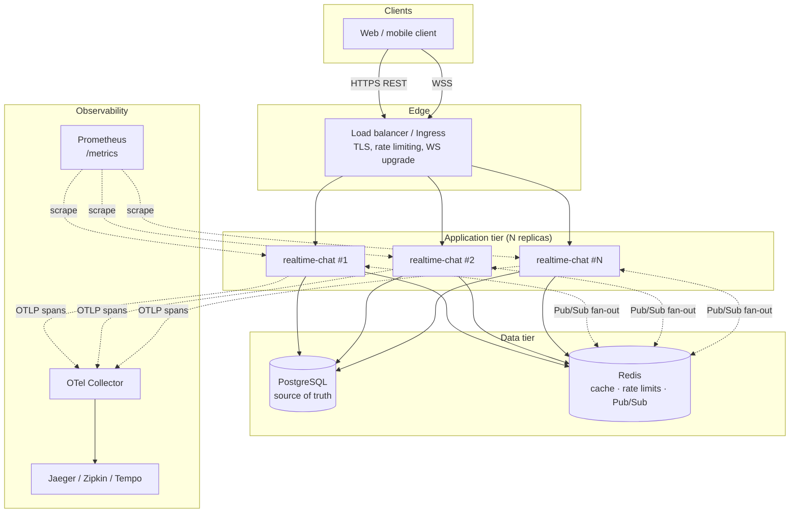
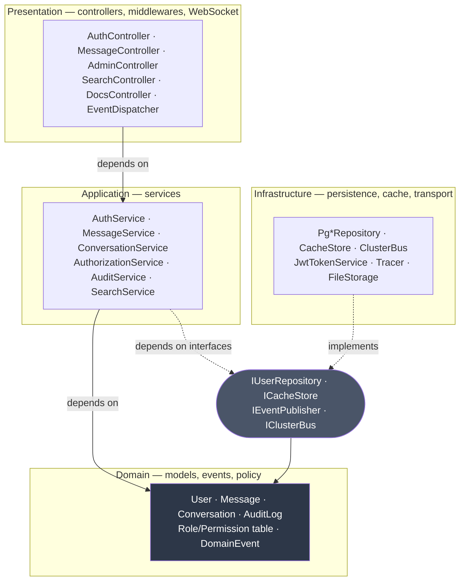
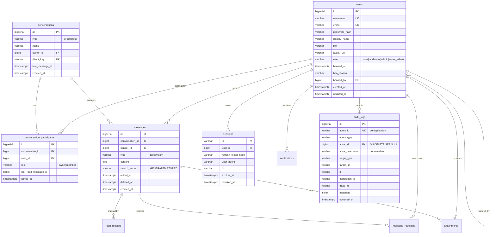
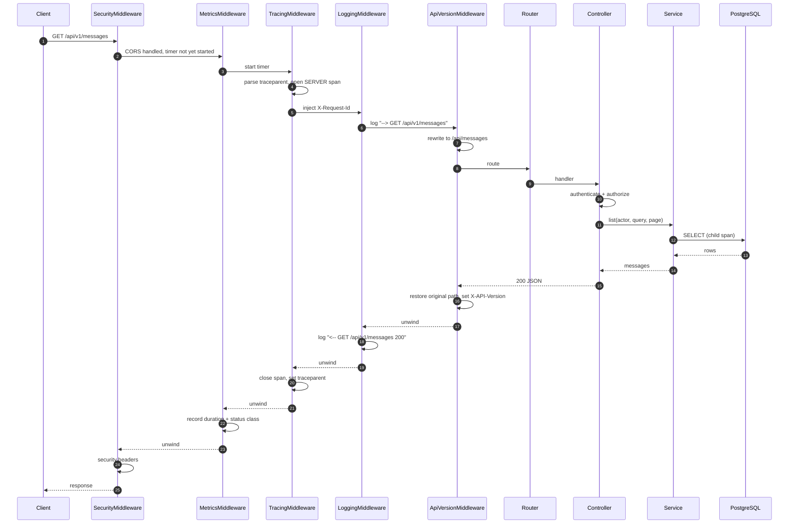
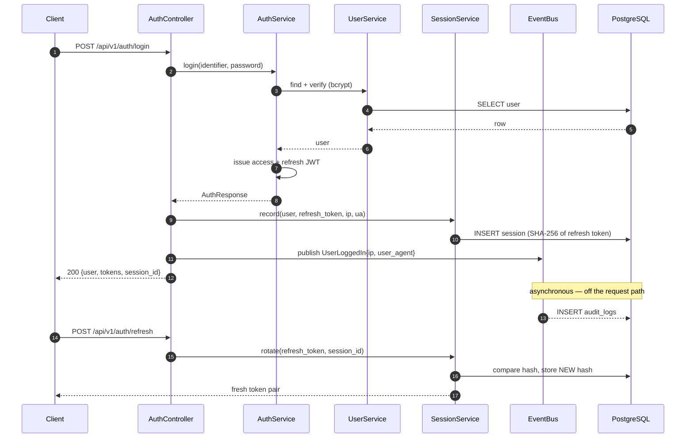
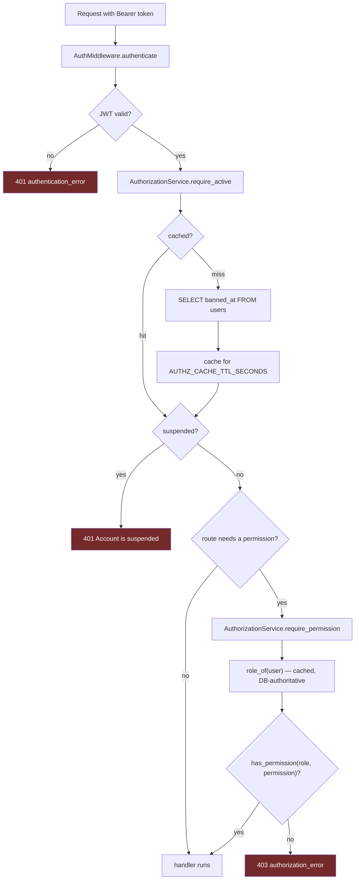
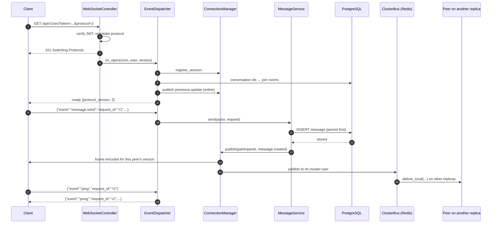
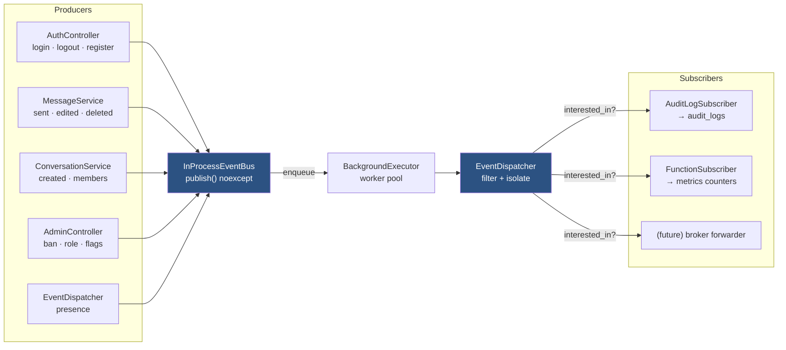
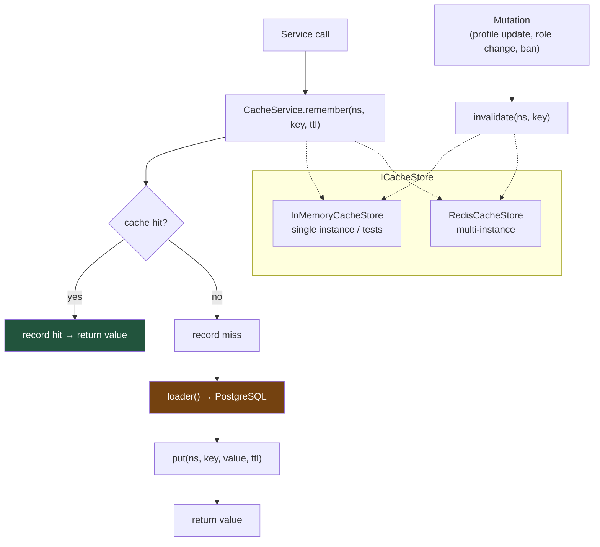
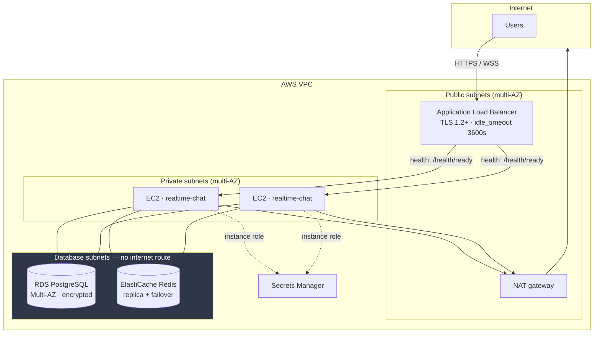

# Architecture diagrams

Mermaid diagrams for the system as it stands. GitHub renders these inline; any
Mermaid-aware viewer will too.

Prose covering the same ground is in [Architecture.md](Architecture.md); this file
is the visual companion, and each diagram is followed by the reasoning that is not
obvious from the picture.

---

## 1. System architecture

The dotted Pub/Sub edges are the load-bearing part. A WebSocket connection is
pinned to whichever replica accepted it, so a message persisted by replica #1 has
no path to a recipient connected to replica #2 without that hop. On a single
replica the problem is invisible; it appears the moment you scale, as intermittent
message loss that does not reproduce locally.

---

## 2. Clean architecture layering

Dependencies point inward. The domain layer knows nothing about PostgreSQL, Crow or
Redis. Services depend on *interfaces* that the domain layer owns, and
infrastructure implements them — so swapping the cache backend, or unit-testing a
service against an in-memory fake, requires no change to business logic. That
inversion is why the test suite can exercise real service code with no database at
all.

---

## 3. Database ERD

Three details are deliberate and easy to get wrong:

* `audit_logs.actor_id` is `ON DELETE SET NULL`, not `CASCADE`. Deleting a user must
  never erase the record of what they did — that history is the whole point.
  `actor_username` is denormalised alongside it so the trail survives the deletion.
* `audit_logs.event_id` is `UNIQUE`. The writer is at-least-once, so the constraint
  plus `ON CONFLICT DO NOTHING` makes a redelivery a no-op rather than a duplicate.
* `messages.search_vector` is a `GENERATED ... STORED` column, computed on write
  and indexed with GIN. The earlier design computed `to_tsvector` per row at query
  time, which cannot use an index reliably.

---

## 4. Request lifecycle

The middleware order is the interesting part. `ApiVersionMiddleware` is
*innermost*: it rewrites the path immediately before routing and is the first to
unwind, restoring the original path so the outer access log reports what the client
actually requested. Because it is innermost, a rejected API version still unwinds
through metrics, logging and the security headers rather than escaping them.

---

## 5. Authentication flow

Refresh tokens are stored only as SHA-256 hashes and are **rotated on every
refresh**. A stolen token that is later replayed no longer matches the stored hash
and is rejected — and the mismatch is itself a signal that a token was
compromised. The audit write happens on the event bus, so an audit outage cannot
fail a login.

---

## 6. Authorisation and RBAC

The role is resolved from the database, not read from the JWT. Putting it in the
token would make authorisation free, and would also mean a demoted moderator or a
banned user keeps their old rights until the access token expires — up to fifteen
minutes. A short-TTL cache keeps the cost to one cache hit while preserving
revocability; mutations call `invalidate()` so the change takes effect immediately.

Call sites ask about a `Permission`, never compare `Role` ordinals: comparing roles
couples every check to the ordering, and inserting a role in the middle would
silently re-authorise code paths.

---

## 7. WebSocket flow

Persist first, broadcast second — always. A client that receives a message the
server failed to store would show history that does not exist. Frames are encoded
once per *distinct protocol version* among the recipients (at most twice), not once
per connection.

The cluster hop uses `deliver_local` on the receiving side. Calling the normal
`publish` there would re-broadcast, and the message would circulate forever; the
origin-node filter in the bus is the second, independent guard against that.

---

## 8. Event flow

Publishing is `noexcept` and asynchronous: the event has already happened by the
time it is published, so a delivery problem is the bus's concern, never the
producer's. Each subscriber runs inside its own try/catch, because subscribers are
independent side effects — if the audit database is down, metrics and notifications
must still work.

Ordering across events is explicitly not guaranteed. Every subscriber here is
order-independent by design; anything needing strict ordering belongs on a message
broker with a partition key, not on an in-process bus.

---

## 9. Cache flow

Invalidation is explicit and lives next to the write that requires it, rather than
being inferred. TTL alone is not sufficient for authorisation data: after a ban or
a role change, `AuthorizationService::invalidate` runs immediately, and the TTL is
only the worst case if an invalidation is ever missed — for example when another
replica performed the change and the backend is the process-local store rather than
Redis.

---

## 10. Deployment topology

The database tier's route table contains only the local VPC route — no NAT, no
internet gateway. A compromised database host therefore has no outbound path for
exfiltration. Security groups reference each other by id rather than by CIDR, so
"only the application may reach the database" stays true regardless of how the
subnets are later resized.

The load balancer health-checks `/health/ready`, not `/health/live`: readiness
fails when a dependency is unavailable, which correctly removes the instance from
rotation. Using liveness would keep an instance receiving traffic while every
request it served failed.
