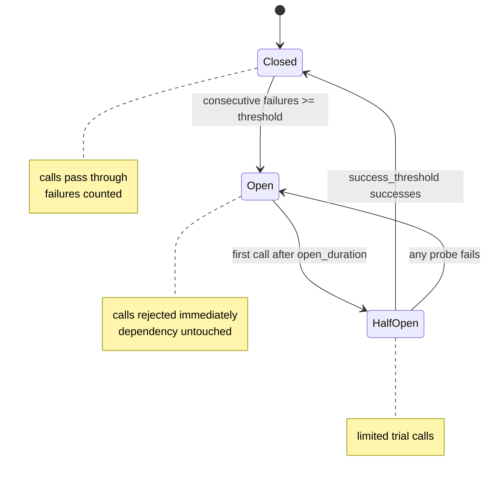

# Reliability

How the service behaves when a dependency misbehaves.

## The failure this is about

When a dependency stops answering, every request that touches it blocks until its
timeout — holding a worker thread the whole time. With enough traffic the pool
fills with threads waiting on something that is not going to answer, and
endpoints that never touch that dependency start timing out too.

The database being slow becomes the whole service being down.

Retries make that worse rather than better: three attempts with backoff hold the
thread three times as long.

## Two tools, opposite problems

| | Absorbs | Mechanism |
| --- | --- | --- |
| **Retry** | A *blip* — connection reset, leader election, brief contention | Try again, with backoff |
| **Circuit breaker** | An *outage* — the dependency is down | Stop trying |

They compose, and the order matters: **the breaker wraps the retry**, not the
other way round. Once the breaker is open, the retries do not run at all.



`Open → HalfOpen` happens on the **first call after** the cooldown, not on a
timer. A breaker guarding an idle path should not spend its life probing
something nobody is asking for.

## Retry

```cpp
run_with_retry(
    RetryPolicy{.max_attempts = 3, .initial_delay = 50ms},
    "user-lookup",
    is_transient,          // mandatory — see below
    [&] { return repository.find(id); });
```

| Setting | Default | Notes |
| --- | --- | --- |
| `max_attempts` | 3 | Includes the first call. `1` means no retry |
| `initial_delay` | 50ms | Before the second attempt |
| `multiplier` | 2.0 | Exponential growth |
| `max_delay` | 2000ms | Ceiling |
| `jitter_ratio` | 0.2 | ±20% randomisation |

### Two decisions worth knowing

**Retries are bounded. There is no "retry forever".** An unbounded retry against
a dependency that is down converts a fast failure into a hung request, and hung
requests exhaust the thread pool.

**The retryable predicate is mandatory — there is no default.** Retrying blindly
is the dangerous case:

- A validation error fails identically every time. Three attempts spend three
  times the latency to return the same `400`.
- A **non-idempotent write that timed out after the server applied it** gets
  applied twice by a retry.

The caller knows which of its failures are transient; the reliability layer does
not, and guessing on the caller's behalf is how duplicate messages appear.

**Jitter is on by default.** Synchronised clients retrying on identical schedules
arrive as a thundering herd precisely when the dependency is least able to absorb
one.

## Circuit breaker

```cpp
run_with_breaker(db_breaker, [&] { return repository.find(id); });
```

| Setting | Default | Notes |
| --- | --- | --- |
| `failure_threshold` | 5 | **Consecutive** failures before opening |
| `open_duration` | 30s | Cooldown before a trial is allowed |
| `half_open_max_calls` | 1 | Concurrent trials permitted |
| `success_threshold` | 1 | Successes needed to close |

Consecutive rather than a rate: a rate needs a window and a minimum volume to
avoid opening on "1 of 1 failed", and consecutive is the simpler contract to
reason about at 3am.

A rejected call throws `CircuitOpenError`, deliberately distinct from the
dependency's own errors. "The dependency refused" and "we did not ask" warrant
different responses — the first may be worth retrying, the second is guaranteed
to fail again until the cooldown elapses.

`on_success()` / `on_failure()` must follow every `allow()` that returned true,
or the breaker's view drifts from reality. Prefer `run_with_breaker`, which
reports outcomes automatically; a hand-written pair is one early return away from
leaving the breaker closed over a dead dependency.

## Testing

Both the retry sleeper and the breaker clock are injected, so
`tests/reliability_test.cpp` asserts the state machine rather than waiting for
wall-clock time. A test that sleeps through a 30-second cooldown is a test nobody
runs.

## What already existed

Worth recording so it is not rebuilt:

| Concern | Where |
| --- | --- |
| Graceful shutdown | `Application::stop()` — ordered, idempotent, reachable from a signal handler |
| Connection-pool acquire timeout | `database/connection_pool.cpp` |
| Span export timeout | `OtlpHttpSpanExporter::Options::timeout` |
| WebSocket heartbeat / idle timeout | `WS_HEARTBEAT_TIMEOUT_SECONDS` |
| Redis reconnect backoff | `realtime/redis_cluster_bus.cpp` — hand-rolled, predates `RetryPolicy` |
| Background job isolation | `BackgroundExecutor` — per-task error isolation, never blocks a request |
| Cross-instance failure degradation | A dead cluster bus degrades to local-only delivery |

## Not implemented, and why

**No RabbitMQ or NATS.** The prompt for this phase asked for one *if a broker did
not already exist*. Asynchronous work is already off the request path via
`BackgroundExecutor` (worker pool, per-task error isolation) with `EventBus` for
in-process fan-out and Redis Pub/Sub for cross-instance delivery.

Adding a broker would buy **durability across a process restart** — genuinely
useful for push notifications and audit writes — at the cost of a new piece of
infrastructure to run, monitor, secure and upgrade. That is a deployment-shaped
decision, not a code-shaped one, and a publisher wired to no real consumers would
be worse than the current arrangement.

The gap it would close is real: work queued in `BackgroundExecutor` when a pod is
terminated is lost. `Application::stop()` drains what it can, but a `SIGKILL`
after the grace period does not.

**Retry and breaker are not yet wired into PostgreSQL or Redis call paths.** The
primitives and their tests exist; applying them to the repository and cache
layers is a separate change, because it needs a per-operation judgement about
idempotency that cannot be made generically — precisely the judgement the
mandatory retry predicate exists to force.
